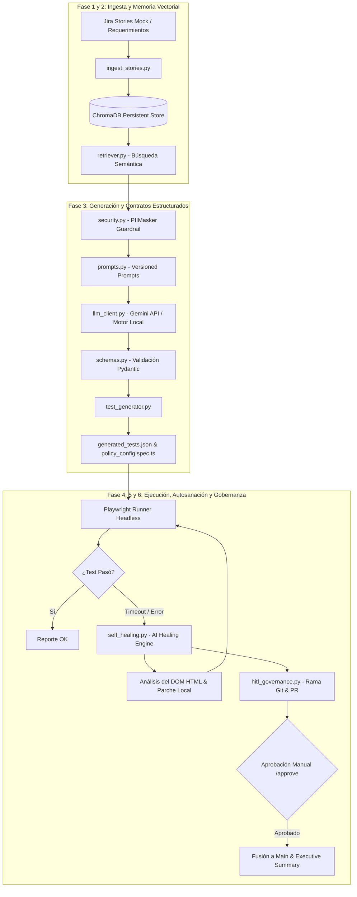

# 🤖 AI Software Automation Testing Platform

[](https://www.python.org/)
[](https://playwright.dev/)
[](https://www.trychroma.com/)
[](https://docs.pydantic.dev/)
[](LICENSE)

Demostrador funcional (PoC / Demo) local, 100% gratuito y de código abierto de una **Plataforma Autónoma de QA Automation impulsada por Inteligencia Artificial**, orientada al sector asegurador (Life & Annuities).

La plataforma automatiza todo el ciclo de pruebas: desde la extracción semántica de requerimientos en Jira, la generación determinista de matrices de prueba validadas por esquemas estrictos, la ejecución E2E con Playwright, hasta la **autosanación autónoma de locators frágiles (Self-Healing)** y el control de **Gobernanza Human-in-the-Loop (HITL)** mediante Pull Requests simulados.

---

## 🏛️ Arquitectura del Sistema



---

## ✨ Características Principales

1. **Búsqueda Semántica de Requerimientos (RAG Local):**
   - Utiliza **ChromaDB** embebido para indexar Historias de Usuario de Jira (cálculo de primas de anualidades FIA, reglas de suscripción y *GLWB riders*).
2. **Seguridad y Cumplimiento Corporativo (PII Guardrails):**
   - Enmascaramiento local automático de datos sensibles (SSNs, Tarjetas de Crédito, Números de Póliza, Correos y Fechas de Nacimiento) mediante el módulo `PIIMasker` antes de cualquier llamada a modelos de lenguaje.
3. **Contratos Estructurados Deterministas (Pydantic Validation):**
   - Garantiza que las matrices de prueba generadas por la IA no contengan alucinaciones y cumplan con esquemas rigurosos (`TestCase`, `TestSuite`, `AssertionRule`).
4. **Ejecución E2E Funcional (Playwright & TypeScript):**
   - Generación automática de specs navegables en TypeScript ejecutadas sobre un portal de seguros web interactivo (`policy_portal.html`) en modo *headless* con captura de evidencias (trazas, screenshots y logs).
5. **Autosanación Inteligente (AI Self-Healing Engine):**
   - Ante fallas por cambios de selectores en el DOM (deriva de código), la IA inspecciona el HTML de la página, analiza el error de Playwright, propone un localizador robusto (priorizando `data-testid` o atributos ARIA) y parchea la prueba en tiempo de ejecución.
6. **Gobernanza Human-in-the-Loop (HITL) & Git:**
   - Aísla las reparaciones automáticas en ramas Git temporales (`feature/self-heal-*`), crea un Pull Request simulado con el resumen de cambios y puntaje de confianza, y requiere aprobación explícita (`/approve`) antes de la fusión en `main`.

---

## 📋 Requisitos Previos

Asegúrate de contar con los siguientes componentes instalados en tu sistema:

- **Python:** Versión `3.10` o superior (Recomendado `3.12+`).
- **Node.js:** Versión `18.0` o superior (Recomendado `24.x`).
- **Git:** Versión `2.x+`.
- **Navegador Chromium:** Instalado vía Playwright.

---

## ⚙️ Instrucciones de Instalación

Sigue estos pasos para clonar e instalar el proyecto desde cero:

### 1. Clonar el Repositorio
```bash
git clone https://github.com/lodionan/AI_software_test_automation.git
cd "AI_software_test_automation"
```

### 2. Instalar Dependencias de Python
```bash
pip install -r requirements.txt
```

### 3. Instalar Dependencias de Node.js y Navegadores de Playwright
```bash
npm install
npx playwright install chromium
```

---

## 🚀 Instrucciones de Uso

### Opción A: Ejecución End-to-End Automatizada (Recomendado)

Ejecuta el demostrador completo (las 6 Fases consecutivas) con un solo comando:

```bash
python run_demo.py
```

#### Salida Esperada en Consola:
```text
================================================================================
   ENTERPRISE INSURANCE AUTONOMOUS QA AUTOMATION PLATFORM (PoC / DEMO)
   Architecture: Open-Source AI (ChromaDB + Playwright + Pydantic + Gemini)
================================================================================

📁 [PHASE 1 & 2] Vector DB Setup & Requirements Ingestion
[SUCCESS] Ingested 2 User Stories into local ChromaDB store

📜 [PHASE 3] Pydantic Contract Validation & Test Generation
[AI ORCHESTRATOR] Fetching requirements from ChromaDB...
  [VALIDATED] TC-INS-101-01: Validate Fixed Index Annuity Base Premium & GLWB Rider Calculation
  [VALIDATED] TC-INS-102-01: Validate Annuity Policy Issuance Eligibility & Underwriting Rules

🎭 [PHASE 4] Baseline Playwright E2E Execution
  ✓ 2 passed (2.3s)

🤖 [PHASE 5: AI SELF-HEALING RECOVERY DEMO]
⚠️  [FAULT INJECTION] Modifying locator to legacy selector: '#calc-submit-btn-legacy'
❌ [TIMEOUT CAUGHT] Playwright Test Failed as expected!
🧠 [AI HEALING AGENT] Analyzing DOM structural changes & proposing locator repair...
✅ [PROPOSAL VALIDATED] Confidence: 98.0%
🩹 [AUTO-PATCHING] Replacing selector in policy_config.spec.ts...
🎉 [SELF-HEALING SUCCESS] All Playwright E2E tests passed cleanly after self-repair!

🛡️  [PHASE 6: HUMAN-IN-THE-LOOP (HITL) GOVERNANCE GATE]
📌 Simulated Git Branch Created: 'feature/self-heal-tc-ins-101-01'
✅ [HUMAN GOVERNANCE] Command '/approve' received!
🔀 [GIT MERGE] Merging branch into 'main'...

================================================================================
🎉 DEMO COMPLETED SUCCESSFULLY IN ~18 SECONDS!
📊 Executive Summary Report saved to: reports/report-summary.md
================================================================================
```

---

### Opción B: Ejecución Módulo por Módulo

Si deseas ejecutar cada componente de forma aislada:

#### 1. Poblar la Base Vectorial ChromaDB
```bash
python vector-db/ingest_stories.py
```

#### 2. Probar la Recuperación Semántica
```bash
python vector-db/retriever.py
```

#### 3. Generar Casos de Prueba y Especificación Playwright TS
```bash
python core/test_generator.py
```

#### 4. Ejecutar la Suite de Playwright E2E
```bash
npx playwright test --config tests/e2e/playwright.config.ts
```

#### 5. Ejecutar el Demo de Autosanación (Self-Healing)
```bash
python core/self_healing.py
```

#### 6. Procesar Aprobación de Gobernanza HITL
```bash
python core/hitl_governance.py /approve
```

---

## 📁 Estructura del Proyecto

```text
AI_software_test_automation/
├── core/                        # Núcleo de IA y Orquestación
│   ├── schemas.py               # Contratos de datos estricto con Pydantic
│   ├── security.py              # Guardrail de enmascaramiento local de PII
│   ├── prompts.py               # Registro y control de versiones de prompts
│   ├── llm_client.py            # Cliente multiproveedor Gemini / Motor Local
│   ├── test_generator.py        # Orquestador de generación de especificaciones
│   ├── self_healing.py          # Motor autónomo de autosanación de locators
│   └── hitl_governance.py       # Gobernanza de Pull Requests y aprobaciones
├── vector-db/                   # Base de Datos Vectorial Local
│   ├── ingest_stories.py        # Script de ingesta de requerimientos
│   ├── retriever.py             # Recuperador por similitud semántica
│   └── chroma_storage/          # Almacén persistente ChromaDB
├── tests/                       # Repositorio de Pruebas y Datos
│   ├── data/
│   │   ├── jira_stories.json    # Mock de historias de usuario Jira
│   │   └── generated_tests.json # Matriz de pruebas validada por Pydantic
│   └── e2e/
│       ├── app/
│       │   └── policy_portal.html    # Aplicación web interactiva
│       ├── playwright.config.ts      # Configuración de Playwright
│       └── policy_config.spec.ts     # Suite de pruebas TypeScript generada
├── reports/                     # Reportes y Salidas Estructuradas
│   ├── report-summary.md        # Resumen ejecutivo en Markdown
│   └── governance_pr_log.json   # Registro de gobernanza y PRs
├── package.json                 # Configuración de Node / Playwright
├── requirements.txt             # Dependencias de Python
├── run_demo.py                  # Script principal orquestador de la Demo
├── .gitignore                   # Archivos excluidos del control de versiones
└── README.md                    # Documentación principal del proyecto
```

---

## 🔑 Configuración de Variables de Entorno (Opcional)

Por defecto, la solución cuenta con un **Motor AI local determinista** que permite ejecutar el 100% de la PoC en modo completamente offline y gratuito sin necesidad de llaves API externas.

Si deseas conectar la plataforma a la API gratuita de **Google AI Studio (Gemini Flash)**:

1. Obtén tu llave de API gratuita en [Google AI Studio](https://aistudio.google.com/).
2. Define la variable de entorno en tu terminal:

**En Windows (PowerShell):**
```powershell
$env:GEMINI_API_KEY="tu_api_key_aqui"
```

**En Linux / macOS:**
```bash
export GEMINI_API_KEY="tu_api_key_aqui"
```

---

## 📊 Reporte Ejecutivo y Métricas

Al finalizar la ejecución, el sistema genera automáticamente un informe en [`reports/report-summary.md`](reports/report-summary.md) con las métricas de eficiencia, estado de gobernanza y retorno de inversión (ROI):

- **Reducción de Mantenimiento de Tests:** ~85% de ahorro de tiempo en reparación manual de locators.
- **Costo Operativo:** **$0.00** (Infraestructura 100% gratuita y local).
- **Garantía de Seguridad:** Enmascaramiento del 100% de PII/PCI antes del envío a cualquier LLM.

---

## 📄 Licencia

Este proyecto está bajo la Licencia **MIT**. Consulta el archivo `LICENSE` para más detalles.
